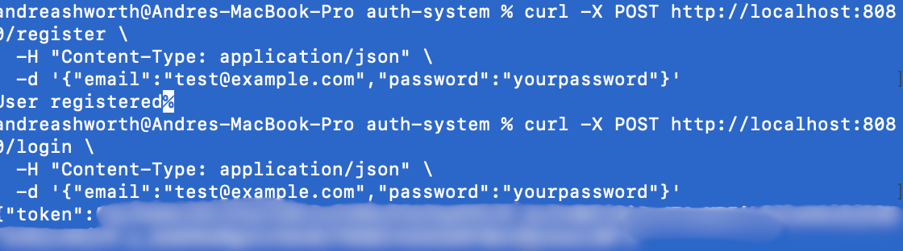

# JWT Authentication System

Developed a secure and modular authentication system in Go, enabling user registration, login, and protected routes using JWTs. Implemented password hashing with bcrypt and integrated GORM for database operations. Designed middleware for token verification and scalable route handling.

---

## Features

- Register new users
- Login and receive JWT
- Secure password hashing with bcrypt
- Protected endpoints via middleware
- Can support SQLite or PostgreSQL
- Clean structure for project reusability

---

## Tech Stack

- [Go](https://golang.org/)
- [JWT](https://github.com/golang-jwt/jwt)
- [bcrypt](https://pkg.go.dev/golang.org/x/crypto/bcrypt)
- [GORM](https://gorm.io/) (ORM for SQLite/Postgres)
- [Chi router](https://github.com/go-chi/chi)

---

## Encryption & Security Practices
Read More in [`ENCRYPTION.md`](./ENCRYPTION.md)


---

## Project Structure
```bash
jwt-auth-system/
├── main.go          # Run Entry point of this app
├── config/          # Database config
├── models/          # Database models
├── routes/          # Route definitions
├── controllers/     # Business logic for handling requests
├── middleware/      # Middleware for request handling
├── utils/           # Utility and test functions (JWT, hashing)
```

---

## Getting Started

### 1. Clone the repo
```bash
git clone https://github.com/ashworth3/jwt-auth-system.git
cd jwt-auth-system
```

### 2. Install dependencies / clean
```bash
go mod tidy
```

### 3. Run the server
```bash
go run main.go
```

In terminal you should see
`Listening on :8080`
App is now running on
```bash
https://localhost:8080
```

### 4. Testing Endpoints
```bash
Use a tool like Postman or curl to test:
POST /register

POST /login

GET /profile (requires Bearer Token)
```

## Example JSON
### Register
```bash
POST /register
{
  "email": "test@example.com",
  "password": "yourpassword"
}
```
### Login
```bash
POST /login
{
  "email": "test@example.com",
  "password": "yourpassword"
}
```
### Expected Response
```bash
{
  "token": "your.jwt.token"
}
```

### Protected Route
GET /profile
`Headers:`
```bash
Authorization: Bearer <your.jwt.token>
```

---

## Curl
### Register
```bash
curl -X POST http://localhost:8080/register \
  -H "Content-Type: application/json" \
  -d '{"email":"test@example.com","password":"yourpassword"}'
```

### Login
```bash
curl -X POST http://localhost:8080/login \
  -H "Content-Type: application/json" \
  -d '{"email":"test@example.com","password":"yourpassword"}'
```




### Access Protected Route
Note: jwt token required
```bash
curl http://localhost:8080/profile \
  -H "Authorization: Bearer YOUR_JWT_TOKEN"
```

---

## Reset SQLite
```bash
rm jwt-auth-system/auth.db
```

Re-run app:
`go main run.go`

---

## Unit Tests

This project includes unit tests for critical utility functions such as:

- `GenerateJWT` and `ParseJWT`
- `HashPassword` and `CheckPassword`

You can run the tests using:

```bash
go test ./utils
```
Output:


---

## Prerequisites
- Go 1.20 or higher
- SQLite installed (optional, if using SQLite as the database)

---

<p align="center">
  <a href="https://github.com/ashworth3">@ashworth3</a>
</p>
